# Spherical Harmonic Tools

Copyright &copy; 2012&ndash;2013 &mdash; [Robert Kooima](http://kooima.net)

This module provides a straightforward implementation of the real spherical harmonic transform and its inverse. It uses the orthonormalized associated Legendre functions, generated by an m-varying recurrence. The implementation is expressed in terms of the Cooley-Tukey fast Fourier transform, so the running time of both synthesis and analysis is O(n3) and n must be a power of two. It is parallelized using OpenMP and will use all available processor cores.

- [sh.hpp](sh.hpp)
- [shtrans.cpp](shtrans.cpp)
- [shimage.cpp](shimage.cpp)
- [sherror.cpp](sherror.cpp)
- [Makefile](Makefile)

## Command Line Tools

A few command line tools are provided to directly apply the transform to real image data. These tools are compiled with [this image handling module](https://github.com/rlk/util3d/blob/master/image.md), which supports input and output of TIFF, PNG, JPEG, and OpenEXR files of any supported depth. For reliable resynthesis, it is _highly_ recommended that frequency-domain images be stored using 32-bit floating point samples in TIFF format, which are the defaults.

### Spherical Harmonic Analysis

`shtrans    [-FDL] [-o output] [-b bytes] input`

Given a `2n` &times; `2n` spatial-domain input image, perform a spherical harmonic analysis of degree `n` and produce an `n` &times; `n` frequency-domain output image.

- `-o output`

    Output file name. Default is "out.tif".

- `-b bytes`

    Output depth in bytes per sample. 1 requests 8-bit unsigned integer. 2 requests 16-bit unsigned integer. 4 selects selects 32-bit float.

- `-h width`  
  `-l width`  
  `-g width`

    After analysis, apply a Hanning `-h`, Lanczos `-l`, or Gauss `-g` filter window with the given width. A width of `n` is used if zero is given. Filter selection is documented below.

- `-d`

    After analysis, apply the diffuse convolution.

- `-F`  
  `-D`  
  `-L`

    Perform the computation using `float`, `double`, or `long double` values. Default is `long double`.

### Spherical Harmonic Synthesis

`shtrans -i [-FDL] [-o output] [-b bytes] input`

Given an `n` &times; `n` frequency-domain input image, perform a spherical harmonic synthesis of degree `n` and produce a `2n` &times; `2n` spatial-domain output image.

- `-o output`

    Output file name. Default is "out.tif".

- `-b bytes`

    Output depth in bytes per sample. 1 requests 8-bit unsigned integer. 2 requests 16-bit unsigned integer. 4 selects selects 32-bit float.

- `-F`  
  `-D`  
  `-L`

    Perform the computation using `float`, `double`, or `long double` values. Default is `long double`.

### Storage of Spherical Harmonics

Spatial domain images are stored in a normal 2n &times; 2n raster with the top of the image corresponding to the north pole of the sphere. Frequency domain images are stored as an n &times; n raster with the following layout. Degree zero is placed at the upper left and the degree increases moving toward the lower right. Negative orders are stored in the rows and positive orders in the column, putting the "zonal" harmonics of order zero along the diagonal. This table shows the degree and order (l, m) corresponding to each pixel of an 8 &times; 8 image.

<table class="grid">
<tr><td>0,        0</td><td>1,       +1</td><td>2,       +2</td><td>3,       +3</td><td>4,       +4</td><td>5,       +5</td><td>6,       +6</td><td>7, 7</td></tr>
<tr><td>1, &ndash;1</td><td>1,        0</td><td>2,       +1</td><td>3,       +2</td><td>4,       +3</td><td>5,       +4</td><td>6,       +5</td><td>7, 6</td></tr>
<tr><td>2, &ndash;2</td><td>2, &ndash;1</td><td>2,        0</td><td>3,       +1</td><td>4,       +2</td><td>5,       +3</td><td>6,       +4</td><td>7, 5</td></tr>
<tr><td>3, &ndash;3</td><td>3, &ndash;2</td><td>3, &ndash;1</td><td>3,        0</td><td>4,       +1</td><td>5,       +2</td><td>6,       +3</td><td>7, 4</td></tr>
<tr><td>4, &ndash;4</td><td>4, &ndash;3</td><td>4, &ndash;2</td><td>4, &ndash;1</td><td>4,        0</td><td>5,       +1</td><td>6,       +2</td><td>7, 3</td></tr>
<tr><td>5, &ndash;5</td><td>5, &ndash;4</td><td>5, &ndash;3</td><td>5, &ndash;2</td><td>5, &ndash;1</td><td>5,        0</td><td>6,       +1</td><td>7, 2</td></tr>
<tr><td>6, &ndash;6</td><td>6, &ndash;5</td><td>6, &ndash;4</td><td>6, &ndash;3</td><td>6, &ndash;2</td><td>6, &ndash;1</td><td>6,        0</td><td>7, 1</td></tr>
<tr><td>7, &ndash;7</td><td>7, &ndash;6</td><td>7, &ndash;5</td><td>7, &ndash;4</td><td>7, &ndash;3</td><td>7, &ndash;2</td><td>7, &ndash;1</td><td>7, 0</td></tr>
</table>

This is a useful layout as it casts an otherwise triangular structure into a square and distinguishes low-frequency harmonics from high-frequency. Together, these properties allow frequency domain images to be edited with common image editing software, enabling interactive spherical harmonic filtering.

### Visualization of Spherical Harmonics

`shimage [-o output] [-b bytes] [-c channels] [-l l] [-m m] [-n n]`

This tool synthesizes an example image of a single spherical harmonic function of degree `l` and order `m`. Positive values are rendered in green and negative values in red. The resulting `n` &times; `n` image is helpful in understanding the appearance and behavior of the spherical harmonics.

- `-o output`

    Output file name. Default is "out.tif".

- `-l l`

    Harmonic degree. Default is 0.

- `-m m`

    Harmonic order. Default is 0.

- `-n n`

    Synthesis degree, which determines output image size.

- `-b bytes`

    Output depth in bytes per sample. 1 requests 8-bit unsigned integer. 2 requests 16-bit unsigned integer. 4 selects selects 32-bit float.

- `-c channels`

    Output channel count. 3 requests unsigned RGB where green implies positive values and red implies negative. 1 selects signed grayscale. In particular, `b`=1 `c`=3 generates a reasonable visualization of a single spherical harmonic, while `b`=4 `c`=1 generates the real value of that harmonic.

Here we see the first eight degrees and orders synthesized at degree 64. They are laid out in an 8 &times; 8 grid as described by the table above. The zonal harmonics are clearly visible along the diagonal and the increasing frequency is obvious toward the right and down.

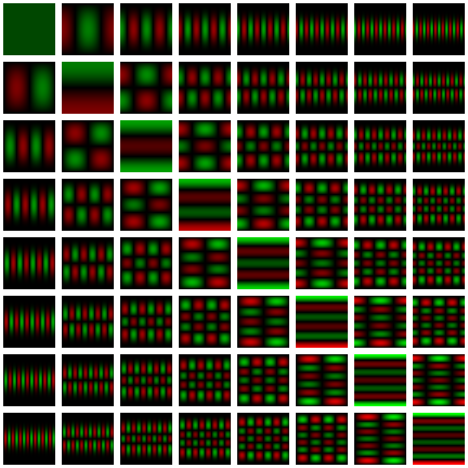

### Validation of Spherical Harmonics

`sherror [-FDL] [-n degree]`

- `-n degree`

    Analysis degree. Default is 1.

- `-F`  
  `-D`  
  `-L`

    Perform the computation using `float`, `double`, or `long double` values. Default is `long double`.

This tool quantifies the performance and precision of the implementation. It begins with white noise, defined as frequency coefficients of one for all `l` and `m` up to `n`. These coefficients are synthesized at a resolution of `2n` &times; `2n`, and re-analyzed up to degree `n`. The round trip time is measured, and the output frequency coefficients are compared with one, giving root-mean-square error and maximum error. Upon completion, a table of results in printed to `stdout` including

1. the degree n,
2. the run time in seconds,
3. the RMS error,
4. the log2 RMS error,
5. the maximum absolute error, and
6. the log2 maximum absolute error.

The log2 results indicate the number of bits to which the output agrees with the input, thus quantifying the numerical stability of synthesis together with analysis. Several runs of this tool are graphed below.

## API

Each of these tools uses a spherical harmonic transformation template library given in the file `sh.hpp`. Templating allows the transform to be calculated using `float`, `double`, or `long double` built-in types. User-defined types are even supported if they overload the basic arithmetic operators and include a few of the functions of the math library.

- `sht<real>::sht(int n, int c)`

    Construct a spherical harmonic transform object. All internal computation will be performed using the `real` type. The frequency domain representation has order n the spatial domain representation has order `2n` &times; `2n`. c gives the number of channels of both.

This object has public attributes for input and output. `S` is a `2n` &times; `2n` spatial domain image with `c` channels of type `real`. `F` is an `n` &times; `n` frequency domain image with `c` channels of type `real`. These images overload the function operator allowing direct access to their contents.

- `real& Flm<real>::operator()(int l, int m, int k)`

    Give a reference to the frequency sample at degree `l`, order `m`, and channel `k` suitable for reading or writing.

- `real& Sij<real>::operator()(int i, int j, int k)`

    Give a reference to the spatial sample at row `i`, column `j`, and channel `k` suitable for reading or writing.

With either the spatial domain or frequency domain image set, analysis or synthesis may be performed.

- `void sht<real>::ana()`

    Perform a spherical harmonic analysis of `S` giving `F`.

- `void sht<real>::syn()`

    Perform a spherical harmonic synthesis of `F` giving `S`.

When performing image IO, both `S` and `F` support bulk transfer functions that automatically cast to and from the internal floating point type to 32-bit floating point.

- `void Flm<real>::set(const float *data, int N)`  
  `void Flm<real>::get(float *data, int N)`

    Transfer 32-bit floating point data into or out of the frequency domain image. The `data` argument must accomodate `N` &times; `N` &times; `c` 32-bit floats. `N` need not be a power of two, and when `N` does not equal `n` then a truncated set of coefficients is accepted or provided.

- `void Sij<real>::set(const float *src)`  
  `void Sij<real>::get(float *dst)`

    Transfer 32-bit floating point data into or out of the spatial domain image. The `data` buffer must accommodate `2n` &times; `2n` &times; `c` 32-bit floats.

In both cases, passing a null pointer to the `set` function initializes the contents of the buffer to zero.

## Examples

This segment of code shows the basic usage of the API for analysis. A square source image with power-of-two size is read from a file and a floating point destination buffer is allocated. A double precision SHT object is instanced with the desired degree and image parameters supplied to the constructor. The spatial domain input is set and the analysis is performed. Finally, the frequency domain output is acquired and written to a file. Synthesis is similar.

    src = image_read_float("input.tif", &w, &h, &c, &b);

    n = w / 2;

    dst = (float *) calloc(n * n * c, sizeof (float);

    sht<double> T(n, c);

    T.S.set(src);
    T.ana();
    T.F.get(dst);

    image_write_float("output.tif", n, n, c, b, dst);

### Environment Mapping

The following examples demonstrate the application of the spherical harmonic tools to real-time environment mapping. We begin with this 32-bit floating-point 512 &times; 512 spherical panorama of a St. Peter's Basilica, one of several de facto standard light probes provided by [Paul Debevec](http://www.pauldebevec.com/Probes/), unwrapped and resampled using [envtools](http://kooima.net/envtools/README.html).

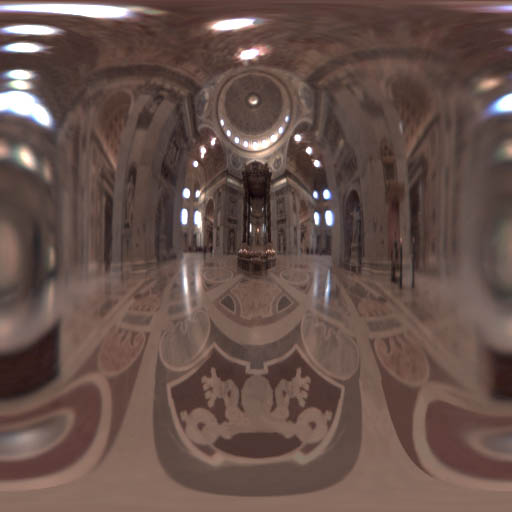

It's a common practice to map such an image onto a model to generate the appearance of a reflective mirror finish...

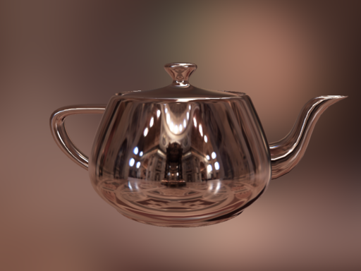

or a refractive glass material with magnifying effects and more subtle reflections. Here, let me hold that up to the light for you.

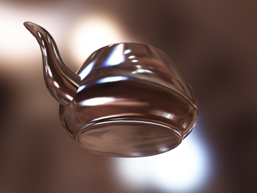

Applying the spherical harmonic transform to the cathedral image allows us to generalize the appearance of such materials through manipulation in the frequency domain. To begin, the image is analyzed at `n`=512 giving a 32-bit 256 &times; 256 floating point frequency domain image.

    shtrans -o st-peters-sht.tif st-peters.tif

The output looks like this.

We can achieve some interesting material effects by removing some of the high-frequency harmonics from it. However, this must be done carefully. To simply crop the frequency domain image at the upper left would corrupt the synthesis with ringing artifacts. Instead, use the `-g` option to apply a Gaussian filter window with a width of 64.

    shtrans -g64 -o st-peters-sht-g64.tif st-peters.tif

Here's the result.

Synthesize this result...

    shtrans -i -o st-peters-g64.tif st-peters-sht-g64.tif

giving this image.

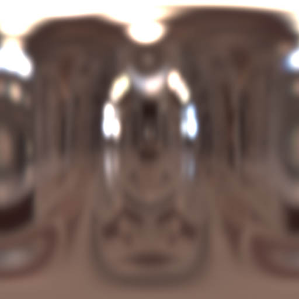

It's a blurry cathedral. Critically, however, this is not a simple 2D blur like that produced by a Photoshop filter. Instead, it behaves as though the blur radius were uniform at every point on the sphere, including the poles. In contrast, a 2D blur of a spherical image would behave as if the blur became increasingly thin toward the poles, producing unsightly artifacts there.

Applying the blurred image to the model shows an imperfect reflection and a frosted refraction, giving a much more natural and realistic material. In addition, all of these images use the width-64 blurred image as a backdrop, giving the appearance of shallow focus regardless of view direction.

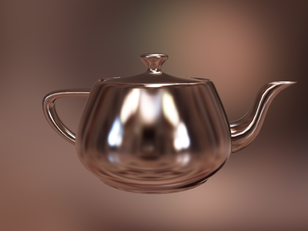

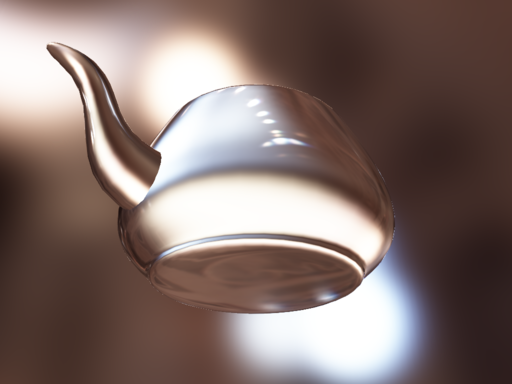

We can take this a step further. Here we apply a Gaussian filter with a width of 32.

    shtrans -g32 -o st-peters-sht-g32.tif st-peters.tif

There's a lot less information in the frequency domain.

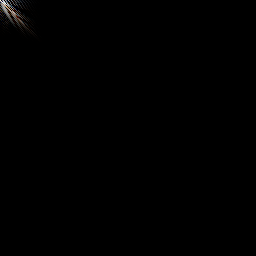

Therefore there's much more blur in the spatial domain. With only 32 degrees of spherical harmonics, only the very low frequencies remain.

    shtrans -i -o st-peters-g32.tif st-peters-sht-g64.tif

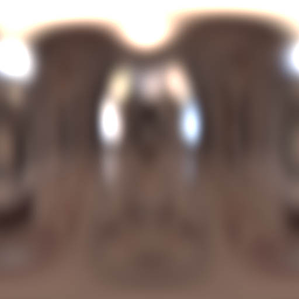

The resulting reflection no longer resembles chrome, and instead takes on the character of pewter or brushed aluminum. In the pinkish glow of St. Peter's Basilica, it almost looks like copper. In comparison, the perfect reflection provided by the original unfiltered environment map looks downright fake.

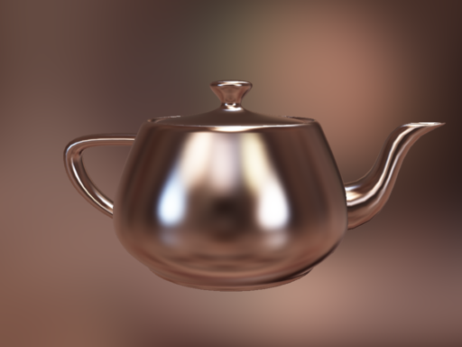

The refractive effect is that of diffuse or frosted glass.

### Diffuse Convolution

These are all specular illumination effects, but the spherical harmonic transform provides a means to extend environment mapping into diffuse illumination, as described by Ramamoorthi and Hanrahan in their 2001 SIGGRAPH paper [An Efficient Representation for Irradiance Environment Maps](http://graphics.stanford.edu/papers/envmap/). In this work, Ramamoorthi and Hanrahan note that diffuse illumination is essentially *convolution* with a cosine-weighted hemisphere, and demonstrate that the resulting *irradiance* need be represented using only three degrees of spherical harmonics.

We can apply the diffuse convolution using the `-d` option.

    shtrans -d -o st-peters-sht-dif.tif sh-peters.tif

Indeed, only the top-left 3 &times; 3 block of pixels contains much data. There are a few dim pixels elsewhere, but the literature demonstrates that eliminating these will result in an average error of at most 3%.

There's so little information here that we could validly crop that image down to 4 &times; 4 (a power of two), resulting in an 8 &times; 8 synthesis with no significant loss of information. But for the sake of consistency with the other examples...

    shtrans -i -o st-peters-dif.tif sh-peters-sht-dif.tif

The resulting *irradiance environment map* is not just very heavily blurred, it actually gives a weighted sum of every input pixel visible at every possible orientation. The sphere map represents the total light falling upon every point on a sphere from every direction. In this example, St. Peter's is well lit from above, and diffuse reflection of the marble gives a pink ambient glow.

When rendering, a single texture reference is made along the object normal. This returns a value equivalent to the usual diffuse lighting calculation, but done for every light source in the room simultaneously. The resulting material is a perfectly matte white, like unglazed ceramic.

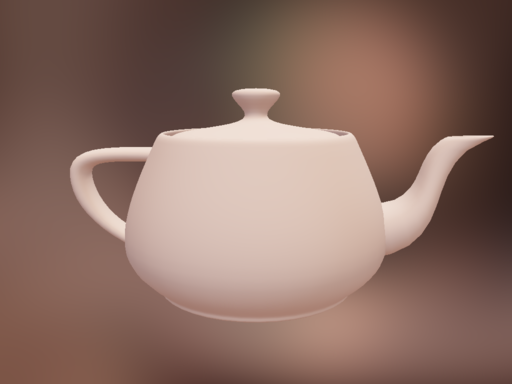

Combining this with one of the reflection maps above gives a specular effect, like glazed ceramic, the material of [the original Utah teapot](http://en.wikipedia.org/wiki/Utah_teapot).

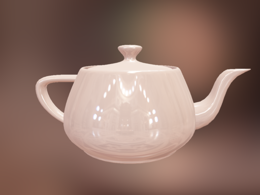

Of course, color and gloss texture maps and normal maps can be combined with these blurred and convolved environment maps, giving very rich and extremely realistic materials.

Here's a summary image giving all of the examples together. Click to enlarge.

[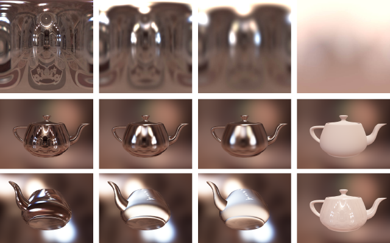](etc/st-peters-all.png)

## Filter Selection

The choice of filter is an important one. Ringing artifacts will *always* arise from a spherical harmonic synthesis with an equirectangular projection. This is because the equirectangular projection *badly* matches the true distribution of information on the sphere. In particular, the spatial resolution near the poles is far higher than near the equator, so any reasonable set of spherical harmonic coefficients will be band-limited at high latitude. The available filters will handle different types of images with varying levels of success. The following examples are intended to help clarify this, but ultimately, experience gained through trial and error are most valuable.

The three filter windows are graphed here for `n`=256. The Gauss window, in red, has the familiar shape of the bell curve, dropping off rapidly and approaching zero smoothly. The Hann (a.k.a. Hanning) window, in green, is a cosine wave with equal balance. The Lanczos window (in blue) is the first lobe of the sinc function, dropping off slowly and meeting zero abruptly.

When the filter width is less than `n`, the Gauss and Hann windows still clamp out at zero. However, the Lanczos window will oscillate about zero as one would expect from the sync function.

The following example uses a 512 &times; 512 image of a 16 &times; 16 black-white checker pattern. With its high contrast, it represents a worst-case scenario for 8-bit images, and will demonstrate the best choice for round-trip frequency-domain operations upon common spherical images.

The checker input is analyzed and re-synthesized four times. Image A shows the center of the input, which covers the equator where the spherical harmonics match the information density in the image well. Image B shows a synthesis of an unfiltered set of coefficients. The ringing is obvious even in this easy area. Images C, D, and E shows the Gauss, Hann, and Lanczos filters, with each sharper than the last.

Here is the same set of images, showing instead a portion of the checker pattern in the troublesome region near the north pole. Image B, with no filtering, is dominated by ringing artifacts. The Gauss, Hann, and Lanczos filters are, again, increasingly sharp. Ringing is generally under control, though slightly apparent in the Lanczos image when magnified.

We can infer from this that *some* form of filtering is necessary. The Lanczos filter preserves the sharpness in the input best, and is probably the go-to choice when doing frequency-domain manipulations of spherical data sets. Blurring is expected and usually even desirable near the poles, especially if the filtered output is to be mapped onto a sphere for real-time texture mapping. Under such circumstances the Gauss filter might produce the most visually appealing results.

Things change when we shift to high dynamic range inputs, such as the light probe of St. Peter's Basilica used in the teapot renderings, above. The following images show the results of each filter applied with a width of 32, cropped at top of the image.

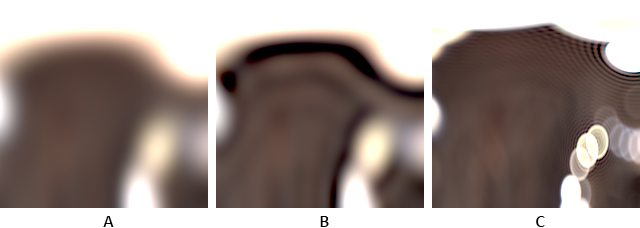

The Gauss filtering in image A gives a nice, smooth blur. The Hann window, image B, does not handle extremely bright light sources well at all, and produces a severe overshoot. The Lanczos window, image C, produces a surprising kind of bokeh effect with high-frequency ringing produced by the many lobes of the tail of the sinc. It's interesting, but not what we're looking for. For high dynamic range light probes, stick with Gauss.

In general, there will always be a trade-off between sharpness and ringing. The type of the data and its intended usage will determine how this trade-off is best made.

## Tests

### Conformance

As a basic eye-ball level test of conformance, the `shtrans` tool was used to synthesize the [EGM 2008](http://earth-info.nga.mil/GandG/wgs84/gravitymod/egm2008/) data set, the Earth Gravitational Model consisting of 2190 degrees of spherical harmonic coefficients. The 8192 &times; 8192 grayscale output was gradient-mapped using [GIGO](http://kooima.net/gigo/README.html) and scaled down using Photoshop. [It matches.](http://images.google.com/images?q=egm2008)

### Precision

The `sherror` tool tests the numerical precision of the spherical harmonic transform implementation by synthesizing and re-analyzing white noise. The task is performed at degrees from `n`= 21 to 212 using single, double, and long double precision floating point values. The output is compared with the input and the degree to which the two match is quantified.

The software was compiled for OSX 10.8 using g++ 4.7.2. The test hardware used 2 &times; 2.0 GHz eight-core Intel Xeon E5 processors. Data shown here was collected using 16 OpenMP threads.

Here are the round trip times, with time in seconds plotted on a log-10 scale. Single precision floating point performance is shown in red, double in green, and long double in blue. G++'s `long double` is in fact an Intel-native 80-bit float, which is the same type that implements single and double precision calculation, so performance parity is not a big surprise. Their stored size varies though, so these results would indicate that the process is not cache-bound on this hardware. The computation is effectively instantaneous when `n` is smaller than 6 and the resolution of the timer was not sufficient to demonstrate any distinction.

Here we see the agreement between the input and the round trip output. Specifically, this graph shows the average number of bits to which each pair of values coincides, as given by the base-2 log of their root-mean-square difference. Single precision floating point (in red) gives at most 24 bits of useful precision and sees a precipitous drop in stability past `n`=24, with a total failure past `n`=27. Double precision (in green) gives 50 bits and sees a similar limit at `n`=27. Long double (in blue) continues to `n`=211. This places an upper bound on the input size that this utility can usefully handle when instanced using native data types: 2048.

Here is the base-2 log maximum difference. Again, it shows the number of binary digits to which the input and output values agree. The results are largely the same as the RMS, and this test is done merely to demonstrate that the RMS does not average away any outliers.

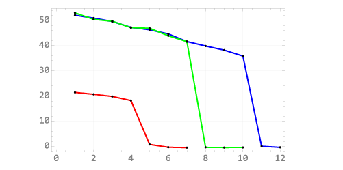

These numbers show that the current implementation is useful in a number of circumstances, but not as powerful as we would like. The use of extended-range arithmetic (Lozier &amp; Smith) will take us beyond the inevitable failure of long double precision, and a GPU-cluster implementation will extend the performance envelope by sheer brute force.

On the bright side, the spherical harmonic transform is a trivially parallelizable process that fully benefits from all floating point capacity placed at its disposal. He we see the speed-up of the round trip test run at `n`=29 in double precision with from one to 32 threads. Speed-up is linear to 16 threads, with 90% efficiency, as this is the number of real processor cores in the test system. They're hyperthreaded cores, and modest gains can be achieved by overcommiting them, though this is not reliable.

